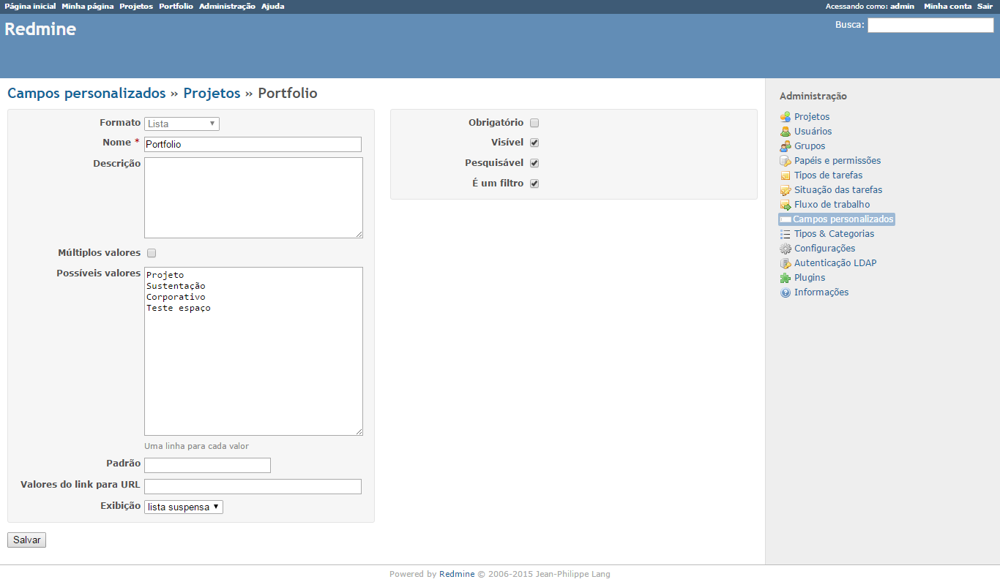
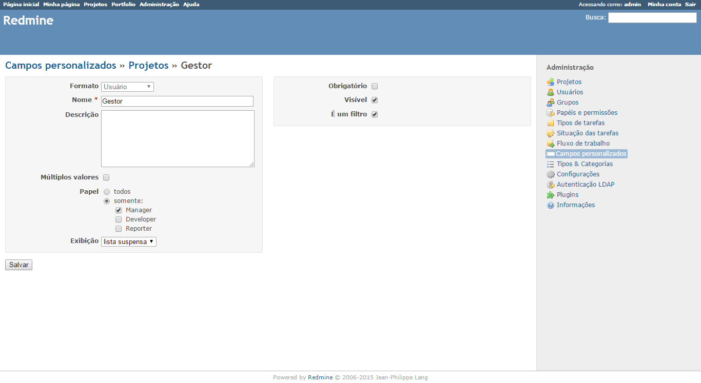
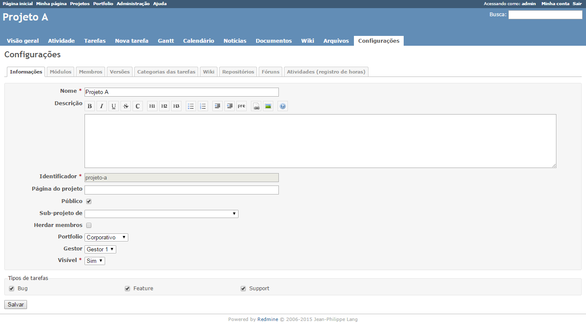

# Redmine Portfolio Management plugin 
[](https://github.com/marcus-sacramento-redmine/redmine_portfolio_management/tags) [](https://github.com/marcus-sacramento-redmine/redmine_portfolio_management/releases) [](https://github.com/marcus-sacramento-redmine/redmine_portfolio_management/releases)

>Plugin criado para permitir a visualição de Projeto em Agrupamentos de Portfolio
>Você pode testá-lo gratuitamente em nosso [Redmine para demonstração](http://redmine-marcusacramento.rhcloud.com/) com usuário e senha: visitante


>>[](https://travis-ci.org/marcus-sacramento-redmine/redmine_portfolio_management)

>>[](https://www.codacy.com/app/marcus-vinicius-cardozo/redmine_portfolio_management) [](https://codeclimate.com/github/marcus-sacramento-redmine/redmine_portfolio_management) [](https://github.com/marcus-sacramento-redmine/redmine_portfolio_management/issues) [](http://waffle.io/marcus-sacramento-redmine/redmine_portfolio_management) [](http://waffle.io/marcus-sacramento-redmine/redmine_portfolio_management)

>>[](https://github.com/marcus-sacramento-redmine/redmine_portfolio_management/commits/master) 

>>[](LICENSE) 

Funcionalidades ([Changelog do Projeto](CHANGELOG.md)):
* Agrupamento de Projetos em visão simplificada por Portfolio
* Filtro Simples e ordenação
* Paginação para permitir melhor visualização dos projetos
* Definição de Data de Início e Data Fim do Projeto por meio das datas das tarefas:
    * Data Início: Menor data do campo 'Início' das tarefas associadas diretamente ao projeto
    * Data Fim: Maior data do campo 'Data prevista' das tarefas associadas diretamente ao projeto
* Cálculo de Percentual de Conclusão do Projeto:
    * Percentual calculado de acordo com o total de tarefas marcadas como concluídas pelo total de tarefas do projeto

>> 

***
## Atenção
* **_Leia atentamente as instruções para instalação;_**
* **_Este é um projeto OpenSource sob [licença](LICENSE);_**
* **_Este projeto foi desenvolvido como experiência sobre a linguagem Ruby, portanto eventuais correções e/ou susgestões poderão ser realizadas com certa demora a depender do tempo disponível do desenvolvedor;_**
* **_Sobre como contribuir para o desenvolvimento do projeto, favor ler o [Contributing Guide](CONTRIBUTING.md) e a Wiki do Projeto_**

***

### Informações sobre o ambiente utilizado no desenvolvimento:
```
Environment:
  Redmine version                3.2.0.stable.14972
  Ruby version                   2.2.3-p173 (2015-08-18) [x86_64-linux]
  Rails version                  4.2.5
  Environment                    production
  Database adapter               PostgreSQL
SCM:
  Subversion                     1.7.14
  Git                            1.8.3.1
  Filesystem  
```

***

### Instalação do Plugin

1. Clonar o projeto através do git: ```https://github.com/marcus-sacramento-redmine/redmine_portfolio_management.git ``` no diretório ```redmine/plugins``` da instalação do Redmine
2. Executar o comando ```bundle install``` para baixar as dependências do projeto.
3. Executar o comando ```rake redmine:plugins:migrate RAILS_ENV=production``` para realizar os ajustes na migração do plugin.
4. Reiniciar o  serviço do Apache:```service httpd restart```

***

### Configuração do Plugin

>> O Plugin exige que sejam configurados alguns campos customizados para os Projetos no Redmine. Os valores nestes Campos Customizados serão exibidos na página principal do plugin

* Configure o Campo Customizado para o Portfolio do Projeto. Esse campo deverá ser do formato Lista e **não** aceitar múltiplos valores. Nos possíveis valores se encontrarão os nomes a serem dados aos Portfolios de Projeto:

>> 

* Configure o Campo Customizado para o Responsável pelo Projeto. Esse campo deverá ser do formato Usuário e **não** aceitar múltiplos valores. Defina os papéis que poderão ser responsáveis pelo projeto:

>> 

* Nas Configurações do Projeto deve-se sempre haver membros associados ao perfil indicado no campo customizado 'Responsável pelo Projeto' antes da configuração dos valores associados ao plugin. Deve-se atualizar a página do Redmine para que as configurações sejam carregadas.

* Após adicionar os membros basta definir o Portfolio e o membro que será o responsável pelo projeto. Caso fique em branco o campo de Portfolio, o projeto não será exibido no plugin:

>> 

### Remoção do Plugin

Para remover o plugin basta remover o diretório do plugin no diretório ```redmine/plugins``` da instalação do Redmine, e reiniciar o  serviço do Apache:```service httpd restart```

